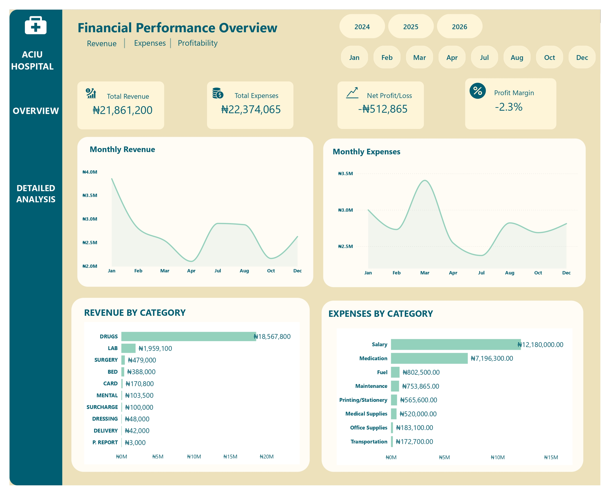
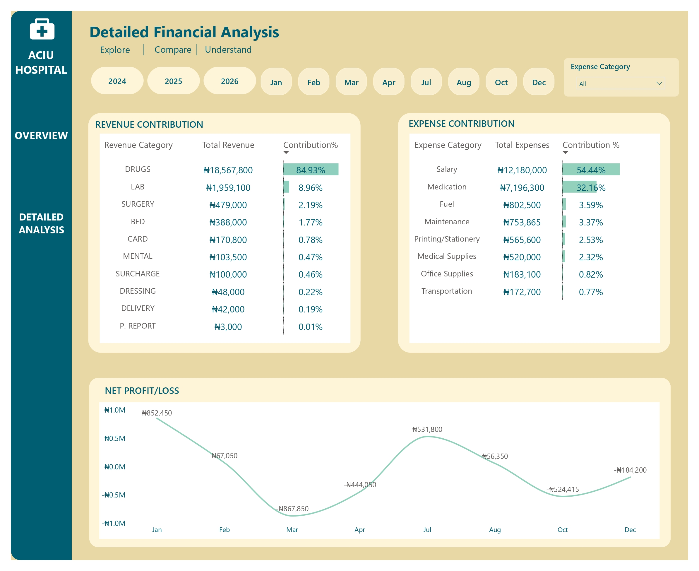
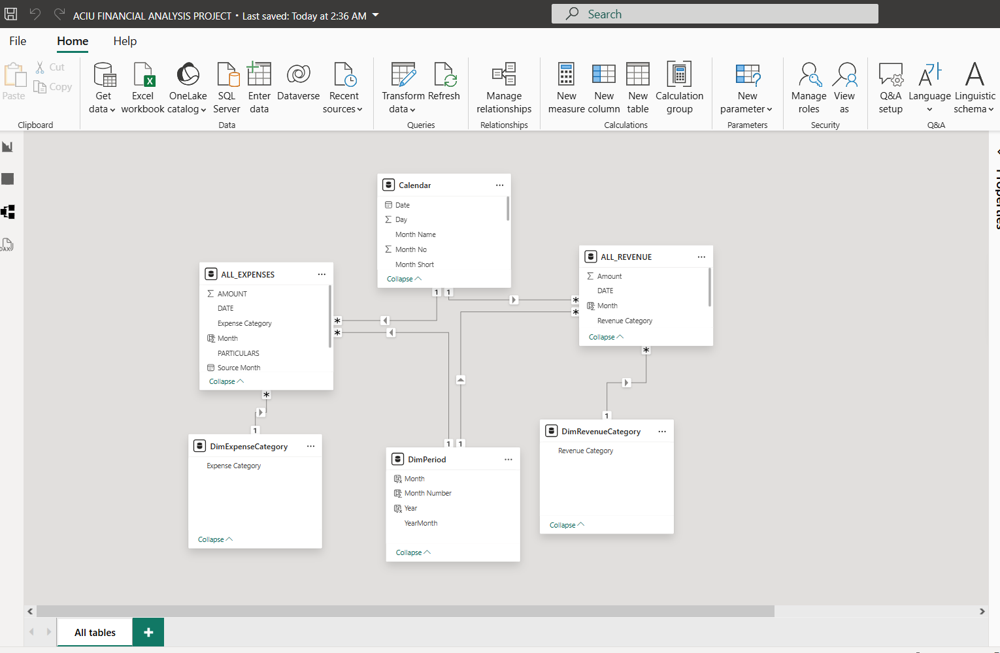

# ACIU Hospital Financial Performance Analysis

Financial performance analysis of ACIU Hospital using Excel, Power Query, and Power BI.

## Project Overview

This project analyzes the financial performance of a hospital using monthly revenue and expense data.

The objective was to transform raw hospital financial reports into a structured dataset, develop a dimensional data model, and build an interactive Power BI dashboard to evaluate revenue, expenses, profitability, and financial trends over time.

The project covers the complete workflow from raw data preparation to data modelling, DAX calculations, and dashboard development.

## Business Questions

The analysis was designed to answer key financial questions, including:

- What is the hospital's total revenue?
- What is the total cost of operation?
- What are the major sources of revenue?
- What percentage of total revenue does each revenue category contribute?
- What are the major expense categories?
- What percentage of total expenses does each category contribute?
- How do revenue and expenses change over time?
- Is the hospital operating at a profit or loss?
- What is the hospital's profit margin?

## Tools & Technologies

- Microsoft Excel
- Power Query
- Power BI
- DAX

## Data Preparation

The raw monthly hospital reports were transformed using Power Query.

Key data preparation steps included:

- Standardizing the structure of monthly reports
- Unpivoting revenue category columns
- Consolidating revenue data across reporting periods
- Combining relevant expense data
- Standardizing expense descriptions
- Creating standardized expense categories
- Adding reporting month information
- Removing unnecessary fields
- Preparing consolidated revenue and expense datasets for analysis

Detailed documentation of the data preparation process is available in:

`documentation/data_preparation.md`

## Methodology

The analysis followed a structured workflow:

1. Review and audit the raw hospital financial reports.
2. Clean and transform the data using Power Query.
3. Consolidate revenue and expense data across reporting months.
4. Design a dimensional data model in Power BI.
5. Create DAX measures for financial performance analysis.
6. Develop interactive dashboards.
7. Analyze revenue, expenses, and overall financial performance.

The detailed methodology is documented in [`methodology.md`](documentation/methodology.md).

## Data Model

The Power BI model follows a dimensional modelling approach.

### Fact Tables

- FactRevenue
- FactExpenses

### Dimension Tables

- Date
- Expense Category
- Revenue Category

The model separates transactional financial data from descriptive dimension tables to support filtering, aggregation, and financial analysis.

## DAX & Financial Analysis

DAX measures were created to evaluate financial performance, including:

- Total Revenue
- Total Expenses
- Operating Result
- Revenue Contribution %
- Expense Contribution %

Functions including `CALCULATE`, `ALL`, `REMOVEFILTERS`, and `ALLEXCEPT` were used to control filter context and calculate financial performance metrics.

Detailed methodology is documented in:

`documentation/methodology.md`

## Dashboard

The Power BI dashboard provides an overview of financial performance and allows users to explore revenue, expenses, and profitability over time.

### Dashboard Overview



### Detailed Analysis



### Data Model



## Project Structure

```text
aciu_hospital_financial_analysis/
│
├── data/
│   ├── raw/
│   └── processed/
│
├── documentation/
│   ├── business_questions.md
│   ├── data_preparation.md
│   └── methodology.md
│
├── images/
│   ├── dashboard_overview.jpg
│   ├── detailed_analysis.jpg
│   ├── data_model.png
│   └── README.md
│
├── power bi/
│
└── README.md
